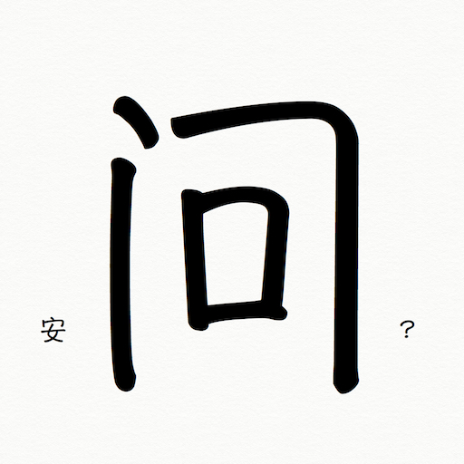

安问 Anwen
========

[安问 - 创造和分享美好](http://anwensf.com/)

Anwen - Create and share something nice

## 目标 Aims
- 自由开源的理想主义社区与创造分享平台
- 致力于创造和分享有趣的东西

## 正在开发 Developing
- 项目重启
- 不断补充有趣的新东西和CC协议(知识共享协议)的优质内容
- 人工智能[安得](http://ande.anwensf.com/)
- 微支付，为作者和分享者提供稿费和其他报酬，与版权方合作 (pause)
- 线下活动等 (pause)
- 各种有趣的小项目 (pause)
- 维基协作更新文章 (pause)

## 更多信息 More Info
- [关于安问](http://anwensf.com/about)
- [升级日志](http://anwensf.com/changelog )
- [安得成长日志](http://anwensf.com/ande-growup-log)
- 遵循OpenAPI V3 规范的RESTful API
- 欢迎参与

## 联系我们 Contact Us
- Email: askender43@gmail.com or anwen.in@gmail.com
- [安问google论坛](https://groups.google.com/d/forum/our-anwen)

## 感谢 Thanks
- all creaters, sharers and members of anwen
- many open soruce projects

## 版权 License
* our code is Released under the MIT license:
  [www.opensource.org/licenses/MIT](http://www.opensource.org/licenses/MIT)
* our dream is Copyleft ^,^ 2011-2013-3001 Anwen
* all our article and other kinds of works is released under   <a rel="license" href="http://creativecommons.org/licenses/by/4.0/">知识共享署名 4.0 国际许可协议</a>.

 本作品采用<a rel="license" href="http://creativecommons.org/licenses/by/4.0/">知识共享署名 4.0 国际许可协议</a>进行许可。
